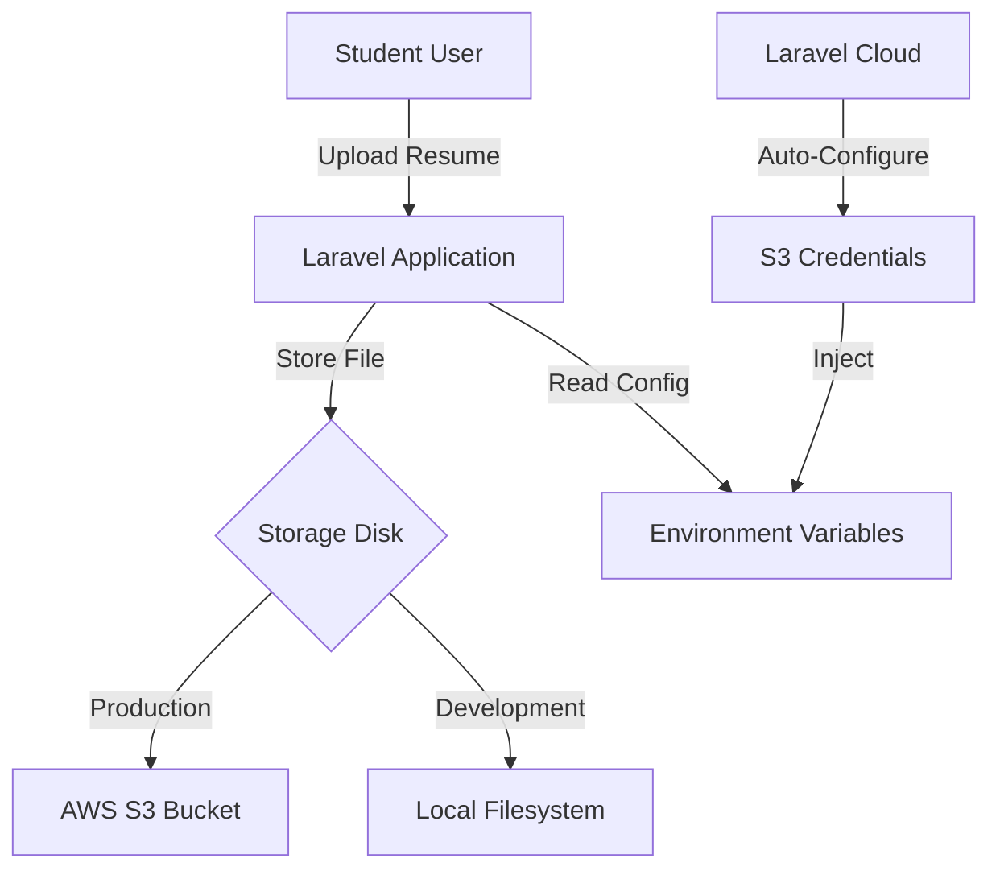
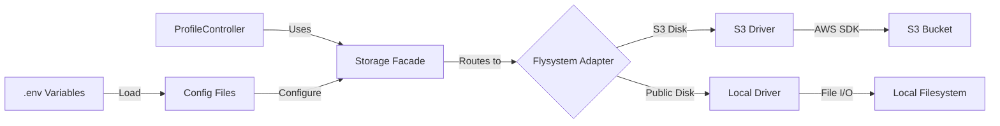
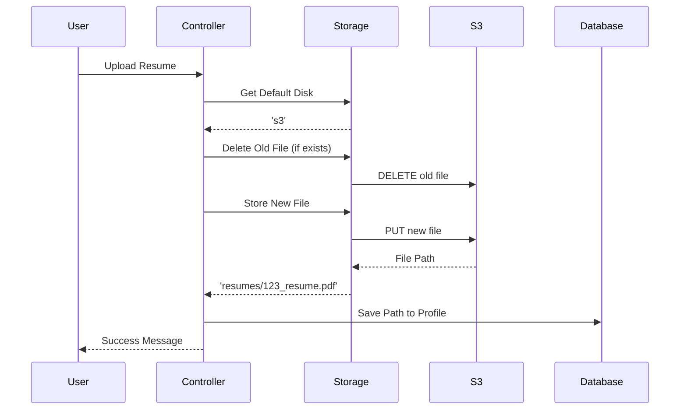
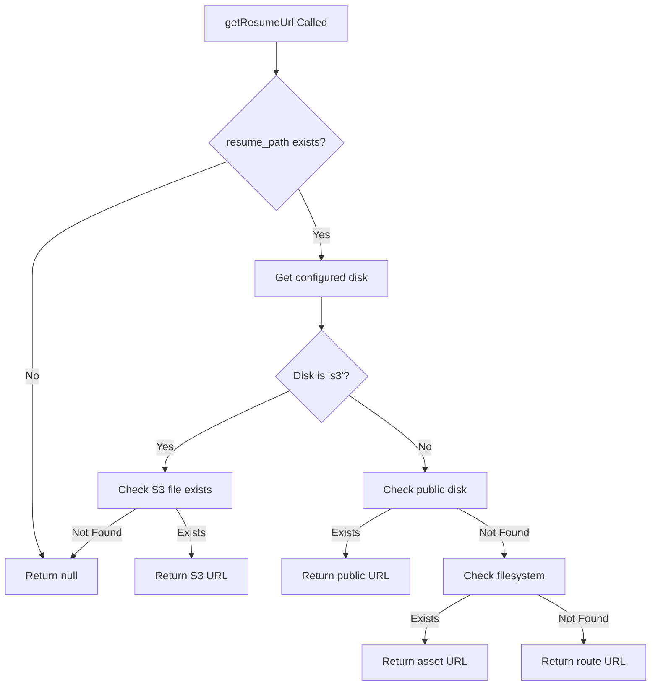
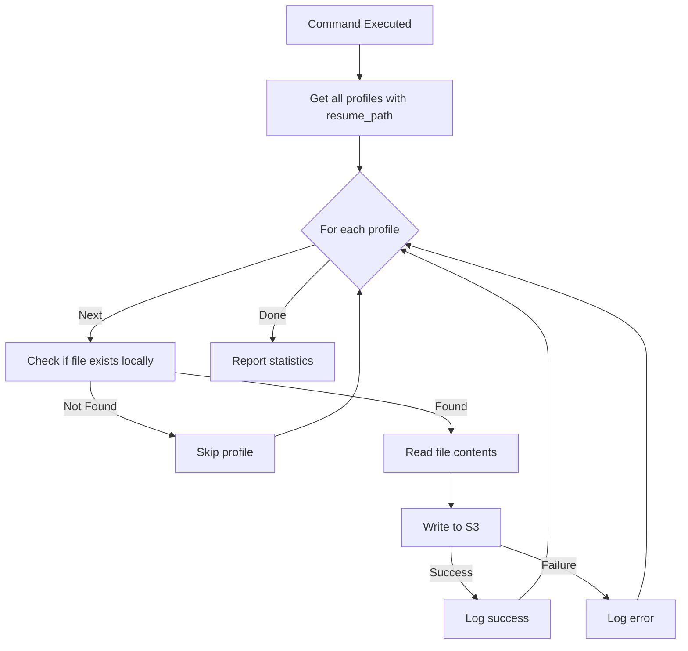
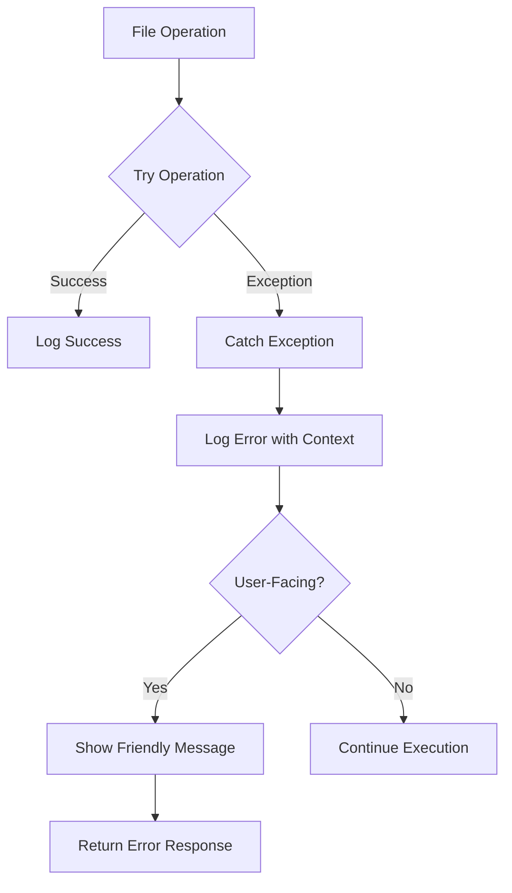

# Design Document: S3 Storage Completion

## Overview

This design implements complete S3 storage integration for the Laravel Student Internship Hub, addressing the missing AWS S3 Flysystem adapter package that currently prevents deployment on Laravel Cloud. The solution provides persistent, scalable file storage for student resume uploads while maintaining backward compatibility with local development environments.

### Problem Statement

The application is deployed on Laravel Cloud with an attached S3 bucket, but lacks the `league/flysystem-aws-s3-v3` package required for Laravel to communicate with S3. This causes deployment failures and prevents file persistence across deployments. While partial S3 support exists in the Profile model and ProfileController, the missing dependency blocks production functionality.

### Solution Approach

The design follows a phased implementation strategy:

1. **Dependency Installation**: Add the AWS S3 Flysystem adapter to composer dependencies
2. **Configuration Management**: Centralize storage disk configuration through environment variables
3. **File Operations**: Implement S3-aware upload, retrieval, and deletion logic
4. **Migration Support**: Provide tooling to migrate existing local files to S3
5. **Error Handling**: Implement comprehensive error handling with user-friendly messages
6. **Testing Infrastructure**: Create verification commands to validate S3 connectivity

### Key Design Decisions

**Decision 1: Use Laravel's Filesystem Abstraction**
- Rationale: Laravel's Storage facade provides a unified API for both S3 and local storage, enabling seamless environment switching
- Trade-off: Slightly less control over S3-specific features, but significantly improved maintainability

**Decision 2: Environment-Based Disk Selection**
- Rationale: Using `config('filesystems.default')` allows runtime disk selection without code changes
- Trade-off: Requires proper environment configuration, but eliminates code duplication

**Decision 3: Graceful Degradation for URL Generation**
- Rationale: Multiple fallback strategies ensure resume URLs work even with misconfigured storage
- Trade-off: More complex logic, but improved reliability in production

**Decision 4: Artisan Command for Migration**
- Rationale: Provides controlled, auditable migration of existing files with progress reporting
- Trade-off: Requires manual execution, but prevents accidental data loss

## Architecture

### System Context



### Component Architecture



### Storage Flow Architecture



## Components and Interfaces

### 1. Composer Dependency Management

**Package**: `league/flysystem-aws-s3-v3`

**Version Constraint**: `^3.0`

**Installation Command**:
```bash
composer require league/flysystem-aws-s3-v3 "^3.0" --with-all-dependencies
```

**Dependencies Added**:
- `league/flysystem-aws-s3-v3`: S3 adapter for Flysystem
- `aws/aws-sdk-php`: AWS SDK for PHP (transitive dependency)
- `guzzlehttp/guzzle`: HTTP client (transitive dependency)

**Composer.json Changes**:
```json
{
    "require": {
        "league/flysystem-aws-s3-v3": "^3.0"
    }
}
```

### 2. Configuration Layer

**Environment Variables** (`.env.example`):
```env
# Filesystem Configuration
FILESYSTEM_DISK=s3

# AWS S3 Configuration (Laravel Cloud auto-populates)
AWS_ACCESS_KEY_ID=
AWS_SECRET_ACCESS_KEY=
AWS_DEFAULT_REGION=us-east-1
AWS_BUCKET=
AWS_URL=
AWS_ENDPOINT=
AWS_USE_PATH_STYLE_ENDPOINT=false
```

**Laravel Cloud Configuration** (`.cloud.yml`):
```yaml
storage:
  disk: s3

environment:
  FILESYSTEM_DISK: s3
```

**Configuration Access Pattern**:
```php
// Get configured disk
$disk = config('filesystems.default'); // Returns 's3' or 'public'

// Get S3 configuration
$s3Config = config('filesystems.disks.s3');
```

### 3. ProfileController File Upload

**Interface**:
```php
public function update(Request $request): RedirectResponse
```

**Upload Flow**:
1. Validate file (PDF, max 2MB)
2. Get configured storage disk
3. Delete old resume if exists
4. Generate sanitized filename
5. Store file to configured disk
6. Save path to database
7. Log operation
8. Return success/error response

**Implementation Pattern**:
```php
// Get disk from configuration
$disk = config('filesystems.default');

// Delete old file with error handling
if ($profile->resume_path) {
    try {
        Storage::disk($disk)->delete($profile->resume_path);
    } catch (\Exception $e) {
        \Log::warning('Failed to delete old resume', [
            'path' => $profile->resume_path,
            'error' => $e->getMessage()
        ]);
    }
}

// Store new file
$filename = time() . '_' . preg_replace('/[^A-Za-z0-9_\-\.]/', '_', $file->getClientOriginalName());
$path = $file->storeAs('resumes', $filename, $disk);

// Log success
\Log::info('Resume uploaded successfully', [
    'user_id' => $user->id,
    'path' => $path,
    'disk' => $disk,
    'filename' => $filename
]);
```

### 4. Profile Model URL Generation

**Interface**:
```php
public function getResumeUrl(): ?string
public function hasResumeFile(): bool
```

**URL Generation Strategy** (Multi-Fallback):



**Implementation Pattern**:
```php
public function getResumeUrl(): ?string
{
    if (!$this->resume_path) {
        return null;
    }

    try {
        $disk = config('filesystems.default');
        
        // S3 Strategy
        if ($disk === 's3') {
            if (Storage::disk('s3')->exists($this->resume_path)) {
                return Storage::disk('s3')->url($this->resume_path);
            }
        }
        
        // Local Strategy (with fallbacks)
        $normalizedPath = ltrim($this->resume_path, '/');
        
        if (Storage::disk('public')->exists($normalizedPath)) {
            return Storage::disk('public')->url($normalizedPath);
        }
        
        $fullPath = storage_path('app/public/' . $normalizedPath);
        if (file_exists($fullPath)) {
            return asset('storage/' . $normalizedPath);
        }
        
        return route('resume.serve', ['filename' => basename($normalizedPath)]);
        
    } catch (\Exception $e) {
        \Log::warning('Resume URL generation failed', [
            'profile_id' => $this->id,
            'resume_path' => $this->resume_path,
            'error' => $e->getMessage()
        ]);
        
        return null;
    }
}
```

### 5. S3 Connectivity Testing

**Artisan Command**: `php artisan storage:test-s3`

**Test Operations**:
1. Write test file to S3
2. Verify file exists
3. Read file contents
4. Delete test file
5. Report results

**Command Interface**:
```php
namespace App\Console\Commands;

use Illuminate\Console\Command;
use Illuminate\Support\Facades\Storage;

class TestS3Connection extends Command
{
    protected $signature = 'storage:test-s3';
    protected $description = 'Test S3 storage connectivity';

    public function handle(): int
    {
        $this->info('Testing S3 connectivity...');
        
        $testFile = 'test-' . time() . '.txt';
        $testContent = 'S3 connectivity test';
        
        try {
            // Test write
            $this->info('1. Writing test file...');
            Storage::disk('s3')->put($testFile, $testContent);
            $this->info('   ✓ Write successful');
            
            // Test exists
            $this->info('2. Checking file exists...');
            if (!Storage::disk('s3')->exists($testFile)) {
                throw new \Exception('File not found after write');
            }
            $this->info('   ✓ File exists');
            
            // Test read
            $this->info('3. Reading file contents...');
            $contents = Storage::disk('s3')->get($testFile);
            if ($contents !== $testContent) {
                throw new \Exception('File contents do not match');
            }
            $this->info('   ✓ Read successful');
            
            // Test delete
            $this->info('4. Deleting test file...');
            Storage::disk('s3')->delete($testFile);
            $this->info('   ✓ Delete successful');
            
            $this->info('');
            $this->info('✅ S3 connectivity test PASSED');
            return Command::SUCCESS;
            
        } catch (\Exception $e) {
            $this->error('❌ S3 connectivity test FAILED');
            $this->error('Error: ' . $e->getMessage());
            
            // Cleanup
            try {
                Storage::disk('s3')->delete($testFile);
            } catch (\Exception $cleanupError) {
                // Ignore cleanup errors
            }
            
            return Command::FAILURE;
        }
    }
}
```

### 6. File Migration Command

**Artisan Command**: `php artisan storage:migrate-to-s3`

**Migration Flow**:


**Command Interface**:
```php
namespace App\Console\Commands;

use App\Models\Profile;
use Illuminate\Console\Command;
use Illuminate\Support\Facades\Storage;

class MigrateFilesToS3 extends Command
{
    protected $signature = 'storage:migrate-to-s3 {--dry-run : Preview migration without making changes}';
    protected $description = 'Migrate existing local resume files to S3';

    public function handle(): int
    {
        $dryRun = $this->option('dry-run');
        
        if ($dryRun) {
            $this->warn('DRY RUN MODE - No files will be migrated');
        }
        
        $profiles = Profile::whereNotNull('resume_path')->get();
        $this->info("Found {$profiles->count()} profiles with resume files");
        
        $successCount = 0;
        $failureCount = 0;
        $skippedCount = 0;
        
        $progressBar = $this->output->createProgressBar($profiles->count());
        $progressBar->start();
        
        foreach ($profiles as $profile) {
            $localPath = $profile->resume_path;
            
            // Check if file exists locally
            if (!Storage::disk('public')->exists($localPath)) {
                $skippedCount++;
                $progressBar->advance();
                continue;
            }
            
            try {
                if (!$dryRun) {
                    // Read from local
                    $contents = Storage::disk('public')->get($localPath);
                    
                    // Write to S3
                    Storage::disk('s3')->put($localPath, $contents);
                    
                    \Log::info('File migrated to S3', [
                        'profile_id' => $profile->id,
                        'path' => $localPath
                    ]);
                }
                
                $successCount++;
                
            } catch (\Exception $e) {
                \Log::error('File migration failed', [
                    'profile_id' => $profile->id,
                    'path' => $localPath,
                    'error' => $e->getMessage()
                ]);
                
                $failureCount++;
            }
            
            $progressBar->advance();
        }
        
        $progressBar->finish();
        $this->newLine(2);
        
        // Report results
        $this->info('Migration Results:');
        $this->info("  ✓ Successful: {$successCount}");
        $this->error("  ✗ Failed: {$failureCount}");
        $this->warn("  ⊘ Skipped: {$skippedCount}");
        
        if ($dryRun) {
            $this->newLine();
            $this->info('Run without --dry-run to perform actual migration');
        }
        
        return $failureCount > 0 ? Command::FAILURE : Command::SUCCESS;
    }
}
```

## Data Models

### Profile Model

**Database Schema** (existing):
```sql
CREATE TABLE profiles (
    id BIGINT UNSIGNED PRIMARY KEY AUTO_INCREMENT,
    user_id BIGINT UNSIGNED NOT NULL,
    name VARCHAR(255) NOT NULL,
    academic_background VARCHAR(255),
    skills JSON,
    career_interests TEXT,
    resume_path VARCHAR(255),
    aadhaar_number VARCHAR(12),
    created_at TIMESTAMP,
    updated_at TIMESTAMP,
    FOREIGN KEY (user_id) REFERENCES users(id) ON DELETE CASCADE
);
```

**Model Attributes**:
- `resume_path`: Stores the S3 key or local path (e.g., `resumes/1234567890_resume.pdf`)
- Path format is consistent across S3 and local storage
- No schema changes required

**Path Format**:
- S3: `resumes/1234567890_resume.pdf` (stored as S3 key)
- Local: `resumes/1234567890_resume.pdf` (stored as relative path)
- Both use the same format for portability

### Storage Configuration Model

**Filesystem Disks** (`config/filesystems.php`):
```php
'disks' => [
    's3' => [
        'driver' => 's3',
        'key' => env('AWS_ACCESS_KEY_ID'),
        'secret' => env('AWS_SECRET_ACCESS_KEY'),
        'region' => env('AWS_DEFAULT_REGION'),
        'bucket' => env('AWS_BUCKET'),
        'url' => env('AWS_URL'),
        'endpoint' => env('AWS_ENDPOINT'),
        'use_path_style_endpoint' => env('AWS_USE_PATH_STYLE_ENDPOINT', false),
        'throw' => false,
    ],
    
    'public' => [
        'driver' => 'local',
        'root' => storage_path('app/public'),
        'url' => env('APP_URL').'/storage',
        'visibility' => 'public',
        'throw' => false,
    ],
],

'default' => env('FILESYSTEM_DISK', 'public'),
```

**Configuration Access**:
```php
// Get default disk
$disk = config('filesystems.default'); // 's3' or 'public'

// Get S3 configuration
$s3Config = config('filesystems.disks.s3');

// Check if S3 is configured
$isS3 = config('filesystems.default') === 's3';
```

## Error Handling

### Error Categories

**1. Upload Errors**
- File validation failure (wrong type, too large)
- Storage write failure
- Old file deletion failure

**2. Retrieval Errors**
- File not found on S3
- URL generation failure
- Permission errors

**3. Configuration Errors**
- Missing AWS credentials
- Invalid S3 bucket
- Network connectivity issues

**4. Migration Errors**
- Source file not found
- S3 write failure
- Partial migration

### Error Handling Strategy



### Error Handling Implementation

**Upload Error Handling**:
```php
try {
    $disk = config('filesystems.default');
    
    // Delete old file (non-critical)
    if ($profile->resume_path) {
        try {
            Storage::disk($disk)->delete($profile->resume_path);
        } catch (\Exception $e) {
            \Log::warning('Failed to delete old resume', [
                'path' => $profile->resume_path,
                'error' => $e->getMessage()
            ]);
            // Continue with upload
        }
    }
    
    // Store new file (critical)
    $path = $file->storeAs('resumes', $filename, $disk);
    
    if (!$path) {
        throw new \Exception('Failed to store resume file');
    }
    
    $profile->resume_path = $path;
    $profile->save();
    
    \Log::info('Resume uploaded successfully', [
        'user_id' => $user->id,
        'path' => $path,
        'disk' => $disk
    ]);
    
    return redirect()->route('profile.show')
        ->with('success', 'Profile updated successfully!');
        
} catch (\Exception $e) {
    \Log::error('Profile update failed', [
        'user_id' => Auth::id(),
        'error' => $e->getMessage(),
        'trace' => $e->getTraceAsString()
    ]);
    
    return redirect()->back()
        ->withInput()
        ->with('error', 'Failed to upload resume. Please try again.');
}
```

**Retrieval Error Handling**:
```php
public function getResumeUrl(): ?string
{
    if (!$this->resume_path) {
        return null;
    }

    try {
        $disk = config('filesystems.default');
        
        if ($disk === 's3') {
            if (Storage::disk('s3')->exists($this->resume_path)) {
                return Storage::disk('s3')->url($this->resume_path);
            }
        }
        
        // Fallback strategies...
        
    } catch (\Exception $e) {
        \Log::warning('Resume URL generation failed', [
            'profile_id' => $this->id,
            'resume_path' => $this->resume_path,
            'error' => $e->getMessage()
        ]);
        
        return null; // Graceful degradation
    }
}
```

### User-Facing Error Messages

**Upload Errors**:
- Generic: "Failed to upload resume. Please try again."
- Validation: "Resume must be a PDF file under 2MB."
- Network: "Upload failed due to network error. Please check your connection."

**Retrieval Errors**:
- File not found: Resume link returns null (handled in view)
- URL generation: Silently falls back to alternative strategies

**Configuration Errors**:
- Missing credentials: Logged to error log, not shown to users
- Invalid bucket: Logged to error log, not shown to users

### Logging Standards

**Log Levels**:
- `info`: Successful operations (uploads, migrations)
- `warning`: Non-critical failures (old file deletion, URL fallbacks)
- `error`: Critical failures (upload failures, configuration errors)

**Log Context**:
```php
\Log::info('Resume uploaded successfully', [
    'user_id' => $user->id,
    'path' => $path,
    'disk' => $disk,
    'filename' => $filename,
    'size' => $file->getSize()
]);

\Log::error('S3 upload failed', [
    'user_id' => $user->id,
    'operation' => 'upload',
    'disk' => $disk,
    'error' => $e->getMessage(),
    'trace' => $e->getTraceAsString()
]);
```

## Testing Strategy

### Unit Testing

**Test Coverage**:
1. Profile model URL generation (S3 and local)
2. Profile model file existence checks
3. Filename sanitization logic
4. Configuration loading

**Example Unit Tests**:
```php
// tests/Unit/ProfileTest.php
public function test_get_resume_url_returns_s3_url_when_configured()
{
    config(['filesystems.default' => 's3']);
    
    Storage::fake('s3');
    Storage::disk('s3')->put('resumes/test.pdf', 'content');
    
    $profile = Profile::factory()->create([
        'resume_path' => 'resumes/test.pdf'
    ]);
    
    $url = $profile->getResumeUrl();
    
    $this->assertStringContainsString('s3', $url);
}

public function test_get_resume_url_returns_null_when_file_not_found()
{
    config(['filesystems.default' => 's3']);
    Storage::fake('s3');
    
    $profile = Profile::factory()->create([
        'resume_path' => 'resumes/nonexistent.pdf'
    ]);
    
    $url = $profile->getResumeUrl();
    
    $this->assertNull($url);
}

public function test_has_resume_file_returns_true_when_file_exists()
{
    config(['filesystems.default' => 's3']);
    
    Storage::fake('s3');
    Storage::disk('s3')->put('resumes/test.pdf', 'content');
    
    $profile = Profile::factory()->create([
        'resume_path' => 'resumes/test.pdf'
    ]);
    
    $this->assertTrue($profile->hasResumeFile());
}
```

### Integration Testing

**Test Scenarios**:
1. End-to-end file upload to S3
2. File retrieval from S3
3. Old file deletion during update
4. Migration command execution
5. S3 connectivity test command

**Example Integration Tests**:
```php
// tests/Feature/ProfileUploadTest.php
public function test_user_can_upload_resume_to_s3()
{
    config(['filesystems.default' => 's3']);
    Storage::fake('s3');
    
    $user = User::factory()->create();
    $this->actingAs($user);
    
    $file = UploadedFile::fake()->create('resume.pdf', 100, 'application/pdf');
    
    $response = $this->post(route('profile.update'), [
        'name' => 'Test User',
        'resume' => $file
    ]);
    
    $response->assertRedirect(route('profile.show'));
    $response->assertSessionHas('success');
    
    $profile = $user->fresh()->profile;
    $this->assertNotNull($profile->resume_path);
    
    Storage::disk('s3')->assertExists($profile->resume_path);
}

public function test_old_resume_is_deleted_when_uploading_new_one()
{
    config(['filesystems.default' => 's3']);
    Storage::fake('s3');
    
    $user = User::factory()->create();
    $profile = Profile::factory()->create([
        'user_id' => $user->id,
        'resume_path' => 'resumes/old.pdf'
    ]);
    
    Storage::disk('s3')->put('resumes/old.pdf', 'old content');
    
    $this->actingAs($user);
    
    $newFile = UploadedFile::fake()->create('new.pdf', 100, 'application/pdf');
    
    $this->post(route('profile.update'), [
        'name' => 'Test User',
        'resume' => $newFile
    ]);
    
    Storage::disk('s3')->assertMissing('resumes/old.pdf');
    Storage::disk('s3')->assertExists($profile->fresh()->resume_path);
}
```

### Manual Testing Checklist

**Local Development**:
- [ ] Upload resume with FILESYSTEM_DISK=public
- [ ] View uploaded resume
- [ ] Update resume (verify old file deleted)
- [ ] Check storage/app/public/resumes directory

**S3 Production**:
- [ ] Deploy with S3 configuration
- [ ] Upload resume with FILESYSTEM_DISK=s3
- [ ] View uploaded resume (verify S3 URL)
- [ ] Update resume (verify old file deleted from S3)
- [ ] Run `php artisan storage:test-s3`
- [ ] Verify files persist after redeployment

**Migration**:
- [ ] Create test profiles with local resumes
- [ ] Run `php artisan storage:migrate-to-s3 --dry-run`
- [ ] Run `php artisan storage:migrate-to-s3`
- [ ] Verify files exist on S3
- [ ] Verify resume URLs work

**Error Scenarios**:
- [ ] Upload with invalid file type
- [ ] Upload with file too large
- [ ] Upload with missing AWS credentials
- [ ] Upload with invalid S3 bucket
- [ ] View profile with missing resume file

### Backward Compatibility Testing

**Test Matrix**:

| Environment | FILESYSTEM_DISK | Expected Behavior |
|-------------|-----------------|-------------------|
| Local Dev | public | Files stored in storage/app/public |
| Local Dev | s3 | Files stored in S3 (if configured) |
| Production | s3 | Files stored in S3 |
| Production | public | Files stored locally (ephemeral) |

**Compatibility Tests**:
```php
public function test_storage_works_with_public_disk()
{
    config(['filesystems.default' => 'public']);
    Storage::fake('public');
    
    $user = User::factory()->create();
    $this->actingAs($user);
    
    $file = UploadedFile::fake()->create('resume.pdf', 100, 'application/pdf');
    
    $response = $this->post(route('profile.update'), [
        'name' => 'Test User',
        'resume' => $file
    ]);
    
    $profile = $user->fresh()->profile;
    Storage::disk('public')->assertExists($profile->resume_path);
}

public function test_url_generation_falls_back_to_local_when_s3_unavailable()
{
    config(['filesystems.default' => 's3']);
    Storage::fake('s3');
    Storage::fake('public');
    
    // File exists on public disk but not S3
    Storage::disk('public')->put('resumes/test.pdf', 'content');
    
    $profile = Profile::factory()->create([
        'resume_path' => 'resumes/test.pdf'
    ]);
    
    $url = $profile->getResumeUrl();
    
    // Should fall back to public disk URL
    $this->assertNotNull($url);
    $this->assertStringContainsString('storage', $url);
}
```


## Correctness Properties

**Property-based testing is not applicable to this feature.**

This feature involves Infrastructure as Code (IaC) configuration and external service integration with AWS S3. The appropriate testing strategies are:

1. **Unit tests with mocks** - Test controller logic with mocked Storage facade
2. **Integration tests with fakes** - Test end-to-end flows with Laravel's Storage::fake()
3. **Smoke tests** - Verify S3 connectivity and configuration
4. **Manual testing** - Validate actual S3 operations in production

Property-based testing is not suitable because:
- File operations test **external service behavior** (AWS S3), not internal logic
- Behavior is **deterministic** - same input produces same output
- Running 100+ iterations would be **expensive** (AWS API calls) without revealing additional bugs
- This is primarily **configuration and integration**, not algorithmic logic

The Testing Strategy section provides comprehensive coverage through unit tests, integration tests, and manual verification procedures.


## Implementation Plan

### Phase 1: Dependency Installation (Requirements 1, 2)

**Tasks**:
1. Add `league/flysystem-aws-s3-v3` to composer.json
2. Run `composer update` to generate composer.lock
3. Update `.env.example` with S3 configuration variables
4. Update `.cloud.yml` with S3 storage configuration
5. Commit composer.json and composer.lock to version control

**Verification**:
- Run `composer show | grep flysystem-aws` to verify package installed
- Check `.env.example` contains all AWS variables
- Check `.cloud.yml` has `storage: disk: s3`

**Estimated Effort**: 30 minutes

### Phase 2: ProfileController Updates (Requirement 3)

**Tasks**:
1. Update file upload logic to use `config('filesystems.default')`
2. Add error handling for S3 operations
3. Add logging for upload operations
4. Add logging for file deletion operations

**Verification**:
- Unit tests for upload logic with mocked storage
- Integration tests with Storage::fake('s3')
- Manual test with actual S3 bucket

**Estimated Effort**: 1 hour

### Phase 3: Profile Model Updates (Requirement 4)

**Tasks**:
1. Update `getResumeUrl()` to handle S3 URLs
2. Update `hasResumeFile()` to check S3
3. Add error handling and logging
4. Maintain backward compatibility with local storage

**Verification**:
- Unit tests for URL generation (S3 and local)
- Unit tests for file existence checks
- Integration tests with both disk types

**Estimated Effort**: 1 hour

### Phase 4: Testing Infrastructure (Requirement 5)

**Tasks**:
1. Create `TestS3Connection` Artisan command
2. Implement write/read/delete test operations
3. Add error reporting and logging
4. Register command in console kernel

**Verification**:
- Run command with valid S3 configuration
- Run command with invalid configuration
- Verify test file is cleaned up

**Estimated Effort**: 45 minutes

### Phase 5: Migration Tooling (Requirement 6)

**Tasks**:
1. Create `MigrateFilesToS3` Artisan command
2. Implement file enumeration logic
3. Implement copy operation with error handling
4. Add progress reporting and statistics
5. Add dry-run mode for testing

**Verification**:
- Test with sample local files
- Run in dry-run mode
- Run actual migration
- Verify files on S3

**Estimated Effort**: 1.5 hours

### Phase 6: Documentation (Requirement 10)

**Tasks**:
1. Create S3_SETUP.md documentation file
2. Document environment variables
3. Document testing procedures
4. Document migration process
5. Add troubleshooting guide

**Verification**:
- Follow documentation to set up S3
- Verify all steps work as documented

**Estimated Effort**: 1 hour

### Phase 7: Testing and Validation (Requirements 7, 8, 9)

**Tasks**:
1. Write unit tests for all components
2. Write integration tests for upload/retrieval flows
3. Test backward compatibility (local and S3)
4. Test error scenarios
5. Validate deployment configuration
6. Manual testing in production

**Verification**:
- All tests pass
- Code coverage > 80%
- Manual testing checklist completed

**Estimated Effort**: 2 hours

**Total Estimated Effort**: 7.75 hours

### Deployment Strategy

**Pre-Deployment**:
1. Merge feature branch to main
2. Verify all tests pass in CI/CD
3. Review deployment checklist

**Deployment Steps**:
1. Push to Laravel Cloud
2. Laravel Cloud auto-installs composer dependencies
3. Laravel Cloud auto-configures AWS credentials
4. Run `php artisan storage:test-s3` to verify connectivity
5. Monitor logs for errors

**Post-Deployment**:
1. Test file upload in production
2. Test file retrieval
3. Run migration command if needed: `php artisan storage:migrate-to-s3`
4. Monitor application logs for S3 errors

**Rollback Plan**:
If S3 integration fails:
1. Set `FILESYSTEM_DISK=public` in Laravel Cloud environment
2. Redeploy application
3. Files will be stored locally (ephemeral)
4. Investigate S3 configuration issues

### Risk Assessment

**High Risk**:
- **Missing AWS credentials**: Mitigated by Laravel Cloud auto-configuration
- **Invalid S3 bucket**: Mitigated by connectivity test command
- **Data loss during migration**: Mitigated by dry-run mode and logging

**Medium Risk**:
- **Performance degradation**: S3 operations are network-bound, may be slower than local
- **Cost overruns**: S3 storage and API calls have costs, monitor usage

**Low Risk**:
- **Backward compatibility**: Extensive testing ensures local storage still works
- **Error handling**: Comprehensive try-catch blocks prevent application crashes

## Deployment Configuration

### Laravel Cloud Configuration

**File**: `.cloud.yml`

```yaml
# Laravel Cloud Configuration
octane: false
php: 8.2

# Storage configuration - use S3
storage:
  disk: s3

# Build commands
build:
  - composer install --no-dev --optimize-autoloader --no-interaction --prefer-dist

# Deployment commands
deploy:
  - php artisan migrate --force
  - php artisan config:cache
  - php artisan route:cache
  - php artisan view:cache
  - php artisan storage:link

# Environment variables
environment:
  APP_ENV: production
  APP_DEBUG: false
  LOG_LEVEL: error
  FILESYSTEM_DISK: s3
```

**Key Configuration Points**:
- `storage.disk: s3` - Tells Laravel Cloud to use S3
- `FILESYSTEM_DISK: s3` - Sets default disk for application
- `php artisan storage:link` - Creates symbolic link (still needed for local assets)

### Environment Variables

**Required Variables** (auto-populated by Laravel Cloud):
```env
AWS_ACCESS_KEY_ID=<auto-filled>
AWS_SECRET_ACCESS_KEY=<auto-filled>
AWS_DEFAULT_REGION=<auto-filled>
AWS_BUCKET=<auto-filled>
```

**Optional Variables**:
```env
AWS_URL=<optional-custom-url>
AWS_ENDPOINT=<optional-custom-endpoint>
AWS_USE_PATH_STYLE_ENDPOINT=false
```

**Application Variables**:
```env
FILESYSTEM_DISK=s3
```

### Verification Steps

**1. Verify Package Installation**:
```bash
composer show | grep flysystem-aws
# Expected: league/flysystem-aws-s3-v3
```

**2. Verify Configuration**:
```bash
php artisan tinker
config('filesystems.default')
# Expected: "s3"

config('filesystems.disks.s3.bucket')
# Expected: your-bucket-name
```

**3. Test S3 Connectivity**:
```bash
php artisan storage:test-s3
# Expected: ✅ S3 connectivity test PASSED
```

**4. Test File Upload**:
- Log in as student
- Navigate to profile page
- Upload resume PDF
- Verify success message
- Check logs for "Resume uploaded successfully"

**5. Test File Retrieval**:
- View profile page
- Click resume link
- Verify file downloads/displays correctly

**6. Verify Persistence**:
- Upload file
- Trigger redeployment
- Verify file still accessible

## Monitoring and Maintenance

### Key Metrics

**Storage Metrics**:
- Total files stored on S3
- Total storage size (MB/GB)
- Upload success rate
- Upload failure rate
- Average upload time

**Performance Metrics**:
- S3 API response time
- File upload latency
- File retrieval latency
- Error rate by operation type

**Cost Metrics**:
- S3 storage costs
- S3 API request costs
- Data transfer costs

### Logging Strategy

**Log Channels**:
- `storage`: Dedicated channel for storage operations
- `daily`: Default channel for general application logs

**Log Levels**:
- `INFO`: Successful operations (uploads, retrievals)
- `WARNING`: Non-critical failures (old file deletion, URL fallbacks)
- `ERROR`: Critical failures (upload failures, configuration errors)

**Log Format**:
```php
\Log::channel('storage')->info('Resume uploaded', [
    'user_id' => $userId,
    'path' => $path,
    'disk' => $disk,
    'size' => $fileSize,
    'duration_ms' => $duration
]);
```

### Monitoring Queries

**Check Recent Uploads**:
```bash
tail -f storage/logs/laravel.log | grep "Resume uploaded"
```

**Check Upload Failures**:
```bash
tail -f storage/logs/laravel.log | grep "Profile update failed"
```

**Check S3 Errors**:
```bash
tail -f storage/logs/laravel.log | grep -i "s3\|aws"
```

### Maintenance Tasks

**Weekly**:
- Review S3 storage usage
- Check for orphaned files (files on S3 not in database)
- Review error logs for patterns

**Monthly**:
- Analyze S3 costs
- Review upload success rates
- Optimize file storage if needed

**Quarterly**:
- Audit S3 bucket permissions
- Review backup strategy
- Update documentation

### Troubleshooting Guide

**Issue 1: Files Not Uploading**

**Symptoms**:
- Upload form submits but no file appears
- Error message: "Failed to upload resume"

**Diagnosis**:
```bash
# Check S3 connectivity
php artisan storage:test-s3

# Check configuration
php artisan tinker
config('filesystems.default')
config('filesystems.disks.s3')

# Check logs
tail -f storage/logs/laravel.log | grep "Profile update failed"
```

**Solutions**:
1. Verify AWS credentials in Laravel Cloud environment
2. Verify S3 bucket exists and is accessible
3. Check S3 bucket permissions
4. Verify network connectivity to S3

**Issue 2: Files Not Retrieving**

**Symptoms**:
- Resume link returns 404
- Resume link is null

**Diagnosis**:
```bash
# Check if file exists on S3
php artisan tinker
$profile = Profile::find(1);
Storage::disk('s3')->exists($profile->resume_path);

# Check URL generation
$profile->getResumeUrl();

# Check logs
tail -f storage/logs/laravel.log | grep "Resume URL generation failed"
```

**Solutions**:
1. Verify file exists on S3
2. Check S3 bucket public access settings
3. Verify S3 URL configuration (AWS_URL)
4. Check for path format issues

**Issue 3: Migration Failures**

**Symptoms**:
- Migration command reports failures
- Files not appearing on S3

**Diagnosis**:
```bash
# Run in dry-run mode
php artisan storage:migrate-to-s3 --dry-run

# Check logs
tail -f storage/logs/laravel.log | grep "File migration failed"
```

**Solutions**:
1. Verify source files exist locally
2. Check S3 write permissions
3. Verify network connectivity
4. Run migration in smaller batches

**Issue 4: High S3 Costs**

**Symptoms**:
- Unexpected AWS bill
- High S3 API request count

**Diagnosis**:
- Review S3 usage in AWS Console
- Check for excessive file operations
- Review application logs for patterns

**Solutions**:
1. Implement caching for file URLs
2. Optimize file existence checks
3. Review and remove orphaned files
4. Consider S3 lifecycle policies

## Security Considerations

### Access Control

**S3 Bucket Permissions**:
- Bucket should NOT be publicly accessible
- Use IAM credentials for application access
- Enable bucket versioning for data protection
- Enable server-side encryption (SSE-S3)

**IAM Policy** (managed by Laravel Cloud):
```json
{
  "Version": "2012-10-17",
  "Statement": [
    {
      "Effect": "Allow",
      "Action": [
        "s3:PutObject",
        "s3:GetObject",
        "s3:DeleteObject",
        "s3:ListBucket"
      ],
      "Resource": [
        "arn:aws:s3:::your-bucket-name/*",
        "arn:aws:s3:::your-bucket-name"
      ]
    }
  ]
}
```

### File Upload Security

**Validation Rules**:
```php
$request->validate([
    'resume' => 'nullable|file|mimes:pdf|max:2048', // 2MB max
]);
```

**Filename Sanitization**:
```php
$filename = time() . '_' . preg_replace('/[^A-Za-z0-9_\-\.]/', '_', $file->getClientOriginalName());
```

**Security Measures**:
- Only allow PDF files
- Limit file size to 2MB
- Sanitize filenames to prevent path traversal
- Use timestamp prefix to prevent filename collisions
- Store files in dedicated `resumes/` directory

### Credential Management

**Best Practices**:
- Never commit AWS credentials to version control
- Use Laravel Cloud's auto-configuration for credentials
- Rotate credentials periodically
- Use separate credentials for development and production
- Monitor credential usage in AWS CloudTrail

### Data Privacy

**Compliance Considerations**:
- Resume files contain personal information (PII)
- Implement data retention policies
- Provide user data deletion capability
- Ensure GDPR/privacy law compliance
- Log access to sensitive files

**Data Deletion**:
```php
// When user deletes account
if ($profile->resume_path) {
    Storage::disk('s3')->delete($profile->resume_path);
}
$profile->delete();
```

## Performance Optimization

### Caching Strategy

**URL Caching**:
```php
// Cache S3 URLs for 1 hour
public function getResumeUrl(): ?string
{
    if (!$this->resume_path) {
        return null;
    }
    
    $cacheKey = "resume_url_{$this->id}";
    
    return Cache::remember($cacheKey, 3600, function () {
        // Generate URL logic...
    });
}
```

**File Existence Caching**:
```php
// Cache file existence checks
public function hasResumeFile(): bool
{
    if (!$this->resume_path) {
        return false;
    }
    
    $cacheKey = "resume_exists_{$this->id}";
    
    return Cache::remember($cacheKey, 3600, function () {
        // Check file existence logic...
    });
}
```

### CDN Integration

**CloudFront Setup** (optional):
1. Create CloudFront distribution for S3 bucket
2. Update `AWS_URL` to CloudFront domain
3. Enable caching with appropriate TTL
4. Configure cache invalidation on file updates

**Benefits**:
- Faster file delivery globally
- Reduced S3 data transfer costs
- Improved user experience

### Lazy Loading

**Implementation**:
```php
// Only load resume URL when needed
public function resume_url()
{
    return $this->getResumeUrl();
}

// In Blade template
@if($profile->resume_path)
    <a href="{{ $profile->resume_url }}" target="_blank">View Resume</a>
@endif
```

### Batch Operations

**Bulk Migration**:
```php
// Process in chunks to avoid memory issues
Profile::whereNotNull('resume_path')
    ->chunk(100, function ($profiles) {
        foreach ($profiles as $profile) {
            // Migrate file...
        }
    });
```

## Future Enhancements

### Potential Improvements

1. **Multiple File Types**
   - Support cover letters
   - Support portfolios
   - Support certificates

2. **File Versioning**
   - Keep history of uploaded resumes
   - Allow users to revert to previous versions
   - Track changes over time

3. **Advanced Processing**
   - Extract text from PDFs for search
   - Generate thumbnails/previews
   - Virus scanning integration

4. **Analytics**
   - Track resume views by recruiters
   - Measure download rates
   - Analyze file access patterns

5. **Optimization**
   - Implement CDN for global delivery
   - Add image optimization for profile photos
   - Implement progressive file uploads

6. **Backup Strategy**
   - Automated S3 backups to separate bucket
   - Cross-region replication
   - Point-in-time recovery

### Technical Debt

**Current Limitations**:
- No file versioning
- No virus scanning
- No file compression
- No CDN integration
- No automated cleanup of orphaned files

**Recommended Improvements**:
1. Implement automated orphaned file cleanup
2. Add file compression for large PDFs
3. Implement virus scanning with ClamAV
4. Add CloudFront CDN for better performance
5. Implement S3 lifecycle policies for cost optimization

## Conclusion

This design provides a complete S3 storage integration for the Laravel Student Internship Hub, addressing all 10 requirements from the requirements document. The implementation follows Laravel best practices, maintains backward compatibility with local storage, and includes comprehensive error handling and testing strategies.

**Key Deliverables**:
1. AWS S3 Flysystem adapter installation
2. Environment-based storage configuration
3. S3-aware file upload and retrieval logic
4. Migration tooling for existing files
5. Connectivity testing infrastructure
6. Comprehensive error handling
7. Unit and integration tests
8. Documentation and troubleshooting guides

**Success Criteria**:
- ✅ Application deploys successfully on Laravel Cloud
- ✅ Resume uploads persist across deployments
- ✅ Files are stored on S3, not local filesystem
- ✅ Backward compatibility maintained for local development
- ✅ All tests pass (unit, integration, manual)
- ✅ Error handling provides clear user feedback
- ✅ Documentation enables easy setup and troubleshooting

**Next Steps**:
1. Review and approve design document
2. Create implementation tasks from design
3. Begin Phase 1: Dependency Installation
4. Follow implementation plan through all phases
5. Deploy to production and validate

